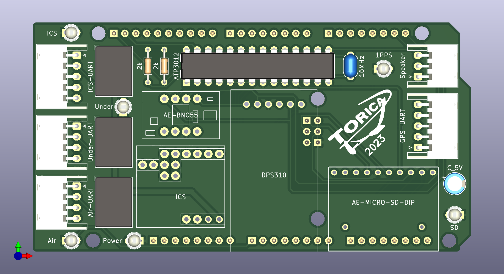

# MainComputer

## 概要
全体的な話は全て[鳥コン滑空機の電装の開発](https://771-8bit.com/secret/birdman-glider-avionics/)を参照

## 一問一答
ブログに書かない細かい話をここでまとめる
### TORICA_UART
- `int readnum = Under_UART.readUART();`のreadnumは何を表しているのか
### TORICA_SD
- SDカードはUART・I2C・SPIのうちどの規格で通信しているか
- `cs_SD`とは何か
- `main_SD.add_str()`と`main_SD.flash()`の違いは何か

### 気圧(DPS310)・姿勢(BNO055)センサー
- `Wire.h`とは何のライブラリか
- I2Cにおいてスレーブはどのように区別するか
- `Wire.setClock(400000);`は何を表しているのか，数値の根拠は何か，数値が異なるとどのような問題があるか
- `dps.configure`は何を設定しているのか，数値の根拠は何か
- MEMSとは何か
- オイラー角・クォータニオンとは何か
### GPS
- `SerialGPS.available() > 0`と`gps.encode(SerialGPS.read())`は何が異なるのか
- 精度よく緯度経度を表現するには小数点以下何桁必要か
- GPSはどのような仕組みで測位を行うか
### センサーデータの扱い
- float，doubleそれぞれ有効桁数は何桁か
- センサーデータを保存するグローバル変数はどのような命名規則か
- センサーデータはどのレベルの[モジュール結合度](https://zenn.dev/taiga533/articles/e08ad4f4af5577079b5b)で扱っているか
- メイン電装のSDカードに保存されるデータの種類は何か
- UART_SDは何の目的で使用される配列か
### 基板上のLED

- Power
    - マイコンが死んでも電源が来ていれば光るのか，マイコンが起動したら光るのか
- SD
    - SDがささっていれば光るのか，SDカードにアクセス中なら光るのか
- ICS
    - ジョイスティック電装部が繋がっていれば光るのか
    - データのフォーマットが正しくなくても光るのか
    - 起動時にLED_ICSが点滅を繰り返す場合，どのような故障を示しているか
- Under，Air
    - データの送受信どちらのタイミングで光るのか
    - データのフォーマットが正しくなくても光るのか
    - 起動時にLED_Airが点滅を繰り返す場合，どのような故障を示しているか
- 1PPS
    - GPSが起動したら光るのか，衛星をロックして位置座標が取得できたら光るのか
### スケジューリング
- 割り込みとは何か
- メイン電装のプログラムで，タスクとその役割と優先度はどのようになっているか
- (実測しないと分からんけど)各タスクは何ms程度の処理時間がかかるか

### C言語の文法など
- `&SerialUnder`の`&`とは何か
- グローバル変数につく`volatile`とは何か
- フォーマット指定子とは何か
- 文字列はマイコン内でどのように表現されるか
- `sprintf`でchar配列に書き込んだ文字列の終端はどのように表現されるか
- `#define`と`const int`の違いは何か，使い分けはどのようにするか
- includeされるライブラリの実体はどこにあるか
